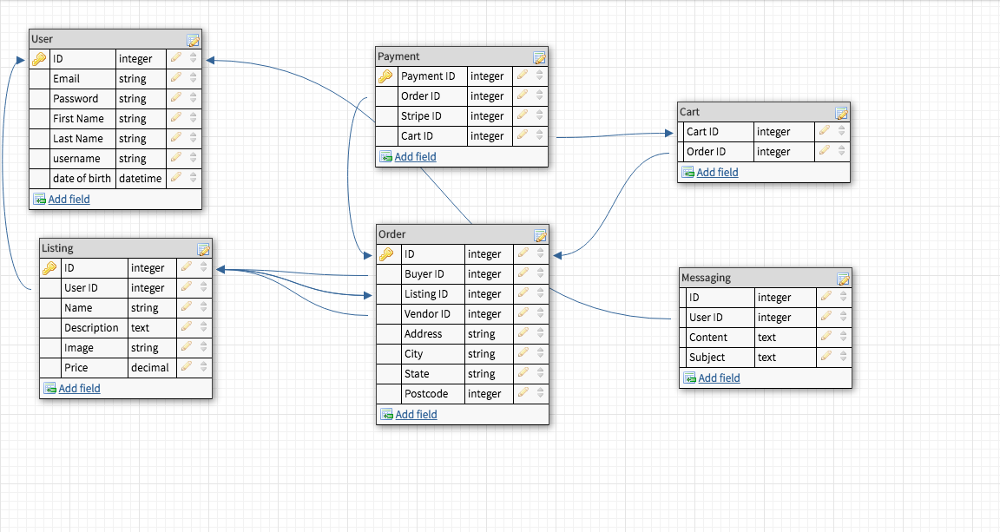

# Documentation

### Want to give it a try?
#### Hosted live at:
> https://morning-stream-13193.herokuapp.com/

### Key Points
> Original idea too complex.

> Took a step back, simplified things. Created a new project keeping it as basic as possible

> Incremental steps, one basic function at a time. Perfect that function and progress forward.

> Added tests for validations and had to constantly update fixtures when changing things, especially with devise.

> Fell in love with boot strap.

> Most challenging part was S3 bucket for heroku.

## Problem
> Students like those enrolled in coder factory academy that need access to reputable quality programming books at a low cost. This problem was really put in to perspective when myself and another cfa student were looking up Rails programming books, with some being as much as $91! This is from fishpond, the cheapest source for books like these I have found online.

## Solution
### BookBuy!!!!

> I developed a two sided marketplace where students like myself and my classmates can sell their books or buy another students for a low price!

### How does it work you ask?
> Well before a user can do anything they must sign up with valid credentials, because without a confirmable email, the user can not use the site. After confirmation, users are free to create as many listings of their books as they want! Likewise, users looking to buy can purchase as many listings as they want.

### Trello!

### Wireframes
> I only created wireframes, not mockups because I had decided I was going to primarily use bootstrap for my entire front end. After going through a few boot strap components, my front end does look slightly different to this. These wireframes were designed for a rough template.

### Database Design
> I tried to keep this relatively simple, most of this was the same in development, a few minor changes were made. I haven't yet implemented a cart or a messaging system and I haven't started recording payments within the db just yet.
> 

## Project Plan
> So I did have this amazing plan that I would get the vital things like payment, authorisation and image uploads all done within a few days then spend the remaining week implementing nice to haves. Boy did that not work out, so here is a rough timeline of my project.

> Like I said before, I broke things down to tiny little tasks. Almost a project within a project. Develop one thing at a time, perfect it then move on.

### Start.
> Generated a scaffold for listings with a name, description and price.

### Images.
> Added an image attribute to listings, decided to use paperclip. Mistake number one(caused a lot of headaches later on.)

### Tests, a new hope!
> I started writing tests! And updating the controller  tests. This was a new world to me. I thought it was easy at first writing simple validation tests. However, I was about to take on devise.

### Bootstrap!
> I started adding light styling with bootstrap, namely a navbar and a footer. I also changed fonts.

### Devise!.
> With listings created, I implemented devise for auth and user login. At the same time I used boot strap devise views, my favourite gem to 'bootstrapify' all devise views within the project.

### The tests strike back.
> All my tests went haywire. Because of devise authentication and restrictions I put on listings(have to be a user), I had to radically change my tests. Not the tests themselves, I had to change the fixtures for my tests to simulate a user login. This was very challenging. Stack overflow did help a lot and my teacher Patrick was there on more than one occasion to help me through it.

### Orders.
> Orders! Generated an orders scaffold for a purchase of a listing(no payment just yet). I wrote some more tests, my confidence building from before. Associated databases, set up everything ready to implement stripe.

### Stripe!
> Implementing stripe in to my project was easy enough, simply following the stripe docs. However using stripe with my listings was a completely different story. Basically I thought I could replace the buy button with a pay by card button. Nope. That took away all validations and I couldn't have an order being placed with empty address fields. So with the help of my teacher Patrick we created a two step system. Basically if all the validations pass then a new page is rendered with the user inputted details and a pay by card button. If validations fail then the orders new page is rendered again.

### Amazon S3
> In the 'downtime' of my project I have been learning some AWS. So for this project I had specific IAM(identity access management) users within my AWS accounts with permissions only for S3 full access. Basically if anyone somehow got my secret keys they would be restricted to that one user, not have root access to my account. S3 was the biggest pain out of the whole project, really coming down to how difficult paperclip is to use it. It took me two days of raising my fist to the computer and a whole lot of obscene language. In the end, I wasn't specifying the proper information for paperclip because it isn't mentioned in any of the docs. Only after multiple google searches of my errors, I found out I was missing vital code as well as an initialiser file to specify default routes for file uploads.  

### Sendgrid, Email Confirmation
> This was a lot more simple than I thought. Setting up sendgrid and action mailer for email confirmations and reset password abilities. Was as easy as adding some db migrations with specific devise information. Editing some config files and wullah.

### Return of the Tests
> So once again after changing the users table my tests started failing again. Basically to do anything on the site a user must be confirmed via email. Once again I had to alter my test fixture to simulate a user login then pass that fixture data in to my tests. At the end of my project I had 17 runs and 44 assertions. More to come once I learn more about testing!

